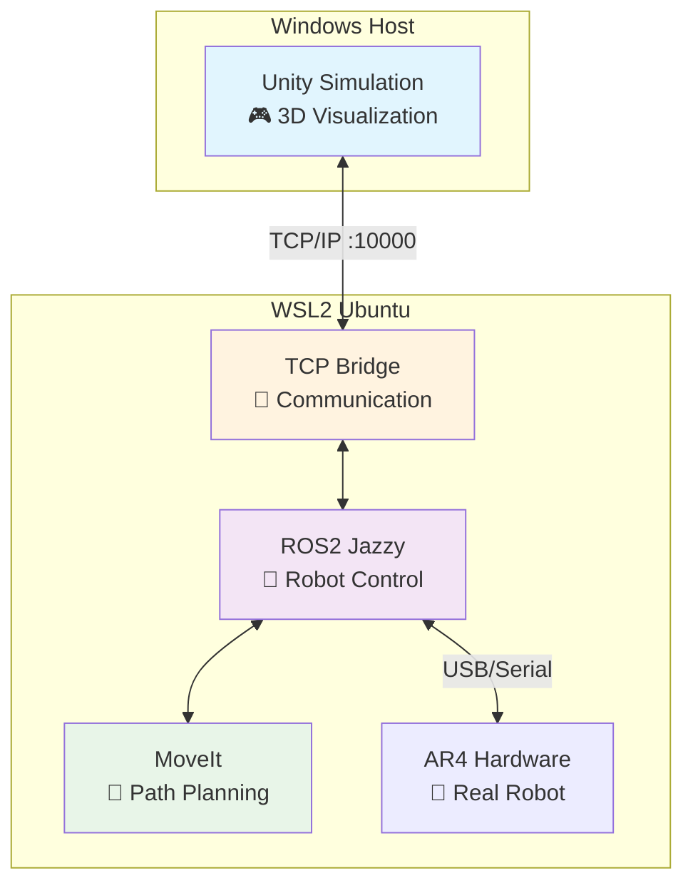

# AR4 Robot Stack 🤖

**통합 AR4 로봇 제어 시스템**

ROS2 워크스페이스와 Unity 시뮬레이션을 서브모듈로 통합한 메타 저장소

<div class="pt-12">
  <span @click="$slidev.nav.next" class="px-2 py-1 rounded cursor-pointer" hover="bg-white bg-opacity-10">
    발표 시작하기 <carbon:arrow-right class="inline"/>
  </span>
</div>

<div class="abs-br m-6 flex gap-2">
  <button @click="$slidev.nav.openInEditor()" title="Open in Editor">
    <carbon:edit />
  </button>
  <a href="https://github.com/kwangchae/ar4-stack" target="_blank" alt="GitHub" title="Open in GitHub"
    class="text-xl slidev-icon-btn opacity-50 !border-none !hover:text-white">
    <carbon-logo-github />
  </a>
</div>

---
transition: fade-out
---

# 목차

<Toc maxDepth="1"></Toc>

---
layout: default
---

# 프로젝트 개요

AR4 Robot Stack은 **교육과 연구**를 위한 완전 통합 로봇 제어 시스템입니다.

<v-clicks>

## 🎯 주요 목표
- **통합 환경**: ROS2 + Unity를 하나의 워크플로우로
- **교육 친화적**: 상세한 문서와 단계별 가이드 제공
- **확장 가능**: 모듈러 구조로 쉬운 기능 추가
- **실용성**: 시뮬레이션에서 실제 하드웨어까지

## 🚀 핵심 특징
- **실시간 시각화**: Unity에서 로봇 움직임을 3D로 확인
- **MoveIt 통합**: 고급 경로 계획 및 충돌 회피
- **Cross-platform**: Windows + WSL2 환경 최적화
- **Docker 지원**: ROS2 TCP 서버 컨테이너화
- **실제 하드웨어 연결**: USB를 통한 AR4 로봇 제어

</v-clicks>

---
layout: center
class: text-center
---

# AR4 하드웨어 구성품

<div class="grid grid-cols-3 gap-4 mt-6">

<div>
<h3 class="text-lg mb-2">🔧 3D 프린팅 부품</h3>

</div>

<div>
<h3 class="text-lg mb-2">⚙️ 모터 및 제어기</h3>

</div>

<div>
<h3 class="text-lg mb-2">🔨 조립 과정</h3>

</div>

</div>

---
layout: default
---

# AR4 로봇 소개

<v-clicks>

## 🦾 AR4 로봇이란?
- **6축 다관절 로봇팔** (Annin Robotics)
- **교육용 로봇**으로 설계됨
- **오픈소스** 하드웨어/소프트웨어
- **합리적인 가격**으로 접근성 좋음

## 📏 주요 사양
- **가동 범위**: 660mm
- **페이로드**: 약 2.5kg
- **반복 정밀도**: ±0.1mm
- **제어**: Arduino + 스텝모터
- **통신**: USB/Serial (ttyUSB0, ttyACM0)

</v-clicks>

---
layout: center
class: text-center
---

# 시스템 아키텍처



---
transition: slide-up
level: 2
---

# 기술 스택

<div class="grid grid-cols-2 gap-4">

<div>

## 🤖 ROS2 영역
- **ROS2 Jazzy**: 최신 로봇 프레임워크
- **MoveIt2**: 모션 플래닝 라이브러리
- **ros-tcp-endpoint**: Unity 통신 브리지
- **moveit_bridge.py**: MoveIt ↔ Unity 실시간 연동
- **Python 3.10+**: 제어 스크립트 작성

```python
# MoveIt 브리지 예시
import rclpy
from moveit_msgs.msg import DisplayTrajectory
from sensor_msgs.msg import JointState

# Plan 시: Unity에 waypoint 전송
# Execute 시: 순차적 joint 전송
class MoveItBridge:
    def trajectory_callback(self, msg):
        self.send_to_unity(msg)
```

</div>

<div>

## 🎮 Unity 영역
- **Unity 6000.2.3f1**: 3D 시뮬레이션 엔진
- **ROS-TCP-Connector**: ROS2 통신 패키지
- **URDF Importer**: 로봇 모델 가져오기
- **C# Scripts**: Unity 로직 구현

```csharp
// Unity에서 ROS 메시지 처리
[System.Serializable]
public class JointStateMsg : Message
{
    public float[] position;
    public float[] velocity;
}

// 경로 시각화
public class TrajectoryVisualizer : MonoBehaviour
{
    void OnTrajectoryReceived(PathMsg path) {
        // 노란 waypoint 표시
    }
}
```

</div>

</div>

---
layout: default
---

# 프로젝트 구조

<div class="grid grid-cols-2 gap-8">

<div>

## 📁 디렉토리 구조
```
ar4-stack/                    ← 메타 저장소
├── ros2-ar4-ws/             ← ROS2 워크스페이스 (서브모듈)
│   ├── src/ar4_ros_driver/   ← AR4 하드웨어 드라이버
│   ├── src/ROS-TCP-Endpoint/ ← Unity 통신 브리지
│   ├── src/moveit_bridge.py  ← MoveIt ↔ Unity 브리지
│   └── src/*.py              ← 제어 스크립트들
├── unity-ar4-sim/           ← Unity 시뮬레이션 (서브모듈)
│   ├── Assets/              ← 3D 모델 및 스크립트
│   └── ProjectSettings/     ← Unity 프로젝트 설정
├── docker-compose.yml        ← 컨테이너 설정
├── VERSIONING.md            ← 버전 관리 정책
└── README.md                 ← 통합 문서
```

</div>

<div>

## 🔄 서브모듈 관리
```bash
# 전체 프로젝트 클론
git clone --recursive \
  https://github.com/kwangchae/ar4-stack.git

# 서브모듈 업데이트
git submodule update --init --recursive

# 개발 워크플로우
cd ros2-ar4-ws
git checkout -b feature/new-controller
# 작업 후 PR 머지

# 상위 리포에서 포인터 업데이트
git add ros2-ar4-ws
git commit -m "chore: bump ros2-ar4-ws submodule"
```

<v-click>

### 📊 버전 관리 정책
- **SemVer**: `v{MAJOR}.{MINOR}.{PATCH}`
- **서브모듈 태그**: 안정성 보장
- **CI 가드**: 무결성 검사

</v-click>

</div>

</div>

---
layout: two-cols
layoutClass: gap-16
---

<template v-slot:default>

# 🚀 설치 및 실행

## 사전 준비
```bash
# Windows 11 + WSL2 설치
wsl --install Ubuntu-24.04

# ROS2 Jazzy 설치 (WSL2)
sudo apt update && sudo apt upgrade -y
sudo apt install software-properties-common
# ... ROS2 설치 과정 생략

# Unity Hub + Unity 6000.2.3f1 설치
# Windows에서 다운로드 및 설치
```

## 프로젝트 설정
```bash
# 전체 시스템 클론
git clone --recursive \
  https://github.com/kwangchae/ar4-stack.git
cd ar4-stack

# ROS2 워크스페이스 빌드
cd ros2-ar4-ws
rosdep install --from-paths . --ignore-src -r -y
colcon build --symlink-install
source install/setup.bash
```

</template>

<template v-slot:right>

## Unity 설정
1. **프로젝트 열기**: `ar4-stack/unity-ar4-sim`
2. **패키지 설치**: Package Manager에서
   - URDF Importer
   - ROS-TCP-Connector
3. **ROS 설정**: Robotics > ROS Settings
   - IP: WSL2 IP 주소 (예: `172.27.144.1`)
   - Port: `10000`

## Docker 실행 (권장)
```bash
# 이미지 빌드
docker compose build

# ROS TCP 서버 실행 (소프트 시뮬레이션)
docker compose up ros

# 실제 하드웨어 연결용 (USB)
docker compose up ros-hw

# 통합 실행 (서버+브리지)
cd ros2-ar4-ws
./scripts/run_server_and_bridge.sh
```

</template>

---
layout: center
class: text-center
---

# 🎥 실행 데모

<div class="text-4xl text-blue-600 mb-8">
  🎮 ➡️ 🤖 ➡️ 📊
</div>

## 3단계 실행 과정

<v-clicks>

### 1️⃣ ROS TCP 서버 시작
```bash
ros2 run ros_tcp_endpoint default_server_endpoint --ros-args -p ROS_IP:=0.0.0.0
```

### 2️⃣ MoveIt 실행
```bash
ros2 launch annin_ar4_moveit_config demo.launch.py
```

### 3️⃣ MoveIt ↔ Unity 브리지
```bash
python3 src/moveit_bridge.py
```

### 4️⃣ Unity 연결
Unity에서 **Play** 버튼 클릭 → 연결 완료!

</v-clicks>

---
layout: default
---

# 주요 기능 및 사용법

<div class="grid grid-cols-2 gap-8">

<div>

## 🎯 MoveIt 경로 계획
<v-clicks>

- **Interactive Marker**: 드래그로 목표 위치 설정
- **Plan**: 경로 계획 수행 → Unity에 노란 waypoint 스트림 전송
- **Execute**: 계획된 경로 실행 → Unity 로봇이 순차적으로 따라감
- **실시간 연동**: moveit_bridge.py로 자동 동기화

</v-clicks>

## 🎮 추가 제어 스크립트
<v-clicks>

```bash
# 키보드 제어
python3 src/simple_keyboard_teleop.py
# q/a: 관절 1, w/s: 관절 2, e/d: 관절 3

# 부드러운 제어
python3 src/smooth_robot_controller.py

# 실제 하드웨어 연결 (USB)
python3 src/keyboard_teleop.py
```

</v-clicks>

</div>

<div>

## 📡 주요 토픽
<v-clicks>

| 토픽 | 타입 | 설명 |
|------|------|------|
| `/joint_command` | `JointState` | Unity 로봇 제어 |
| `/joint_states` | `JointState` | 현재 관절 상태 |
| `/trajectory_preview` | `Path` | 궤적 waypoint |
| `/display_planned_path` | `DisplayTrajectory` | MoveIt 계획 |

</v-clicks>

## 🔧 부드러운 제어
<v-clicks>

```bash
python3 src/smooth_robot_controller.py
```

- **보간**: 매끄러운 관절 움직임
- **속도 제한**: 안전한 동작 보장
- **실시간 피드백**: 현재 상태 모니터링

</v-clicks>

</div>

</div>

---
layout: default
---

# 🛠️ 문제 해결 가이드

<div class="grid grid-cols-2 gap-6">

<div>

## ❗ 일반적인 문제들

### 서브모듈이 비어있는 경우
```bash
git submodule update --init --recursive
```

### ROS2 빌드 실패
```bash
rosdep install --from-paths . --ignore-src -r -y
colcon build --symlink-install --cmake-clean-cache
```

### Unity 연결 문제
```bash
# WSL2 IP 재확인
hostname -I

# TCP 서버 재시작
pkill -f default_server_endpoint
ros2 run ros_tcp_endpoint default_server_endpoint
```

</div>

<div>

## 🔍 디버깅 도구

### ROS2 상태 확인
```bash
# 실행 중인 노드
ros2 node list

# 토픽 목록
ros2 topic list

# 메시지 모니터링
ros2 topic echo /joint_states
```

### Unity 로그 확인
- **Console**: `Window > General > Console`
- **ROS 로그**: `Robotics > ROS Settings > Logs`

### 성능 최적화
- **Configuration**: Release 모드
- **Scripting Backend**: IL2CPP
- **API Level**: .NET Standard 2.1

</div>

</div>

---
layout: center
class: text-center
---

# 📚 참고 자료

<div class="grid grid-cols-2 gap-12 mt-12">

<div>

## 🔗 프로젝트 링크
- **메인 저장소**: [ar4-stack](https://github.com/kwangchae/ar4-stack)
- **ROS2 워크스페이스**: [ros2-ar4-ws](https://github.com/kwangchae/ros2-ar4-ws)
- **Unity 시뮬레이션**: [unity-ar4-sim](https://github.com/kwangchae/unity-ar4-sim)
- **버전 관리**: [VERSIONING.md](https://github.com/kwangchae/ar4-stack/blob/main/VERSIONING.md)

## 📖 공식 문서
- **AR4 로봇**: [Annin Robotics](https://www.anninrobotics.com/)
- **MoveIt2**: [Official Docs](https://moveit.ros.org/)
- **ROS2**: [ROS2 Documentation](https://docs.ros.org/en/jazzy/)

</div>

<div>

## 🛠️ 개발 도구
- **VS Code**: ROS 및 Python 확장
- **Windows Terminal**: 멀티 탭 터미널
- **Unity Hub**: 프로젝트 관리
- **Docker**: 컨테이너 개발 환경

## 💬 커뮤니티
- **GitHub Issues**: 질문 및 버그 리포트
- **Discussions**: 아이디어 공유
- **Wiki**: 추가 문서 및 튜토리얼

</div>

</div>

---
layout: center
class: text-center
---

# 감사합니다! 🙏

<div class="text-6xl mb-8">
🤖 AR4 Robot Stack 🤖
</div>

**질문이나 피드백이 있으시면 언제든 연락주세요!**

<div class="mt-12 flex justify-center gap-8">
  <a href="https://github.com/kwangchae/ar4-stack" target="_blank"
     class="px-6 py-3 bg-blue-600 text-white rounded-lg hover:bg-blue-700 transition-colors">
    📂 GitHub 저장소
  </a>
  <a href="https://github.com/kwangchae/ar4-stack/issues" target="_blank"
     class="px-6 py-3 bg-green-600 text-white rounded-lg hover:bg-green-700 transition-colors">
    💬 이슈 및 토론
  </a>
</div>

<div class="mt-8 text-gray-500">
  Made with ❤️ using Slidev
</div>